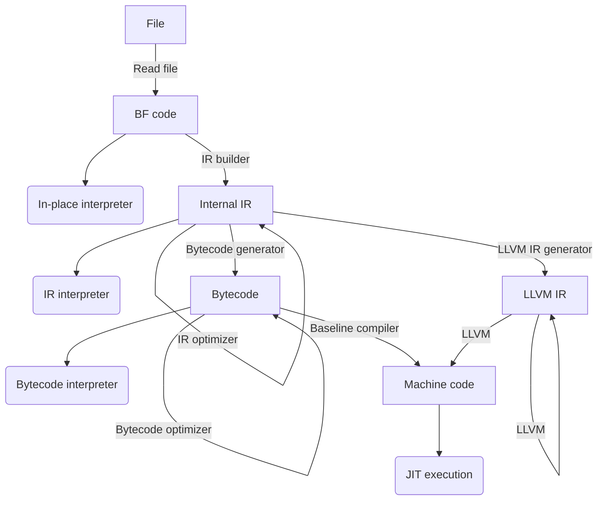

# High-performance Brainfuck

This is a fast virtual machine for Brainfuck. This is as useless as it sounds,
but it was fun to implement and debug, and that is what counts.


## Features

* **Configurable cell size** between 8 bit, 16 bit, 32 bit, or 64 bit cells.
* **Decently fast** in place interpreter.
* **Way faster** optimizing bytecode interpreter.
* **Even faster** baseline JIT compiler with basic register allocation and instruction selection.
* Optionally, a **LLVM based** JIT compiler for faster runtime, at the expense of significantly slower startup times.
* Unlike many other fast virtual machines for Brainfuck, this one uses **dynamically sized memory** by default.
* Optionally use **statically sized memory** for even faster execution.


## How fast is it?

`hpbf` provides five different backends with different runtime performance and startup time
characteristics. The baseline JIT compiler is only supported on x86_64 platforms. The LLVM
based JIT compiler is not enabled by default, so you must pass `--features llvm` to Cargo
if you want to build this project with LLVM support. Note that you will need to have LLVM 17
installed for that to work.

The following table shows the performance of the virtual machine for executing different
programs that can be found in the `examples/` directory. All times include the reading of
the code from a file, the parsing, optimization, and compilation of the code, in addition
to the actual execution of the program.

| `$FLAGS`              | `mandel.bf` | `hanoi.bf` | `factor.bf` | `dbfi.bf^2(hello.bf)` |
|-----------------------|-------------|------------|-------------|-----------------------|
| `--inplace`           |     17.272s |    10.162s |    235.852s |               89.494s |
| `--ir-int -O0`        |      5.959s |      826ms |    132.505s |               84.820s |
| `--ir-int -O1`        |      6.282s |       32ms |     51.007s |               86.448s |
| `--ir-int -O3`        |      6.381s |       34ms |     51.062s |               84.531s |
| `--bc-int -O0`        |      2.053s |      175ms |     35.887s |               21.004s |
| `--bc-int -O1`        |      1.423s |       18ms |     11.848s |               20.809s |
| `--bc-int -O3`        |      1.413s |       21ms |     11.731s |               20.764s |
| `--bc-int --static`   |      1.310s |       19ms |     11.761s |               15.409s |
| `--llvm-jit -O0`      |      9.245s |      315ms |     55.432s |              272.589s |
| `--llvm-jit -O1`      |      1.158s |      276ms |      4.292s |               18.345s |
| `--llvm-jit -O2`      |      1.173s |      246ms |      4.294s |               18.305s |
| `--llvm-jit -O3`      |      1.222s |      379ms |      4.351s |               18.486s |
| `--llvm-jit -O4`      |      1.481s |      571ms |      3.700s |               18.719s |
| `--llvm-jit -O5`      |      1.472s |      573ms |      3.689s |               18.789s |
| `--llvm-jit --static` |       693ms |      237ms |      3.442s |               11.338s |
| `--base-jit -O0`      |      1.146s |      108ms |     16.331s |               18.880s |
| `--base-jit -O1`      |       796ms |    **13ms**|      3.508s |               19.193s |
| `--base-jit -O3`      |       843ms |       17ms |      3.501s |               19.257s |
| `--base-jit --static` |    **512ms**|       16ms |   **3.057s**|            **10.336s**|

* `mandel.bf` was run using `./target/release/hpbf --time -f examples/mandel.bf $FLAGS`.
* `hanoi.bf` was run using `./target/release/hpbf --time -f examples/hanoi.bf $FLAGS`.
* `factor.bf` was run using `./target/release/hpbf --time -f examples/factor.bf $FLAGS <<< "87178291199"`.
* `dbfi.bf^2(hello.bf)` was run using `cat examples/dbfi.bf examples/input.bf examples/hello.bf examples/input.bf | ./target/release/hpbf --time -f examples/dbfi.bf $FLAGS`.

Note that all of these benchmarks are programs with a long runtime. For small programs with a
long runtime, the LLVM JIT compiler performs best, as it can amortize the significant compile
time overhead. The baseline JIT compiler is a good all around choice if supported on the given
platform. The bytecode interpreter is the default choice for platforms not supported by the
baseline JIT compiler. For programs that are very large, but for which runtime does not matter,
consider using `-O0` to reduce the startup time.


## How does it work?

The following diagram depicts the different components of this virtual machine. The function
of each are explained below.



### A Brainfuck program

Let us look at the following code snippet, which is an extract from `examples/primes.bf`:

```brainfuck
[>+>+<<-]>>[<<+>>-]<<<[>>>>>+<<<[>+>+<<-]>>[<<+>>-]
<[>>[-]<<-]>>[<<<<[>+>+<<-]>>[<<+>>-]<>>>-]<<<-<<-]
```

After loading the code into memory from RAM, it can immediately be executed using the
in place interpreter. The interpreter does not create any tables for the loop jumps,
so skipped loops will still have to iterate over all instructions in the loop.


### Building the internal IR

The first step to improving the execution performance is to transform the Brainfuck
program into a representation that is more amenable to optimization. During this translation,
the implementation already coalesces increment instructions to the same cell, detects
loops such as `[-]` or `[+]`, and delays moves until the end of a basic block. The result
of the IR building step for the above program is the following:

```
loop [0] {
  [0] -= 1
  [1] += 1
  [2] += 1
}
loop [2] {
  [0] += 1
  [2] -= 1
}
loop [-1] {
  loop [1] {
    [1] -= 1
    [2] += 1
    [3] += 1
  }
  loop [3] {
    [1] += 1
    [3] -= 1
  }
  [4] += 1
  loop [2] {
    [4] = 0
    [2] -= 1
  }
  loop [4] {
    loop [0] {
      [0] -= 1
      [1] += 1
      [2] += 1
    }
    loop [2] {
      [0] += 1
      [2] -= 1
    }
    [4] -= 1
  }
  [-1] -= 1
  [1] -= 1
}
move -1
```

This code can now already be executed using the IR interpreter, however, it is
still possible to significantly optimize this code.


### Optimizing the internal IR

Clearly there is still much room for optimization. For example, a loop like the following
`[>+<-]` could be replaced by `[1] = [0]` and `[0] = 0`. The IR optimizer is a little
more sophisticated than that, but in principle, it performs mainly conditional constant
propagation, loop analysis, and dead code elimination. The IR optimizer performs multiple
passes over the IR, that all perform the same operations. The first pass is performed without
any analysis result, and all subsequent passes use the analysis results that were computed
in the previous passes. The optimizer is particularly effective for cases where loops are
balanced. Imbalanced loops cause the optimization to perform poorly, because it can not
easily eliminate the loops.

The program above for example will be optimized to the following:
```
[1] += [0]
[0] += [2]
[2] = 0
loop [-1] {
  [2] = [1]
  [4] += 1
  if [2] {
    [2] = 0
    [4] = 0
  }
  [1] += [3] + [0]*[4] - 1
  [3] = 0
  [4] = 0
  [-1] -= 1
}
```


### Generating Bytecode

While the above program is reasonably optimized, the data structures of the internal
IR are not optimized for fast interpretation. For this reason, the IR can be transformed
into a bytecode format, that can than be interpreted much faster. Since some instructions
in the IR require temporary variables to be computed, the bytecode includes, in addition
to the normal memory addresses also a few temporaries. Further, in the bytecode
all ifs and loops are encoded as relative branches, allowing the bytecode to be represented with one
flat array of instruction. The bytecode generator also performs some optimizations, like
instruction fusion, dead store elimination, global value numbering, and register allocation.

The optimized program above will generate the following bytecode:
```
; temps 2
; min -65
; max 65
  copy %0, [0]
  add [1], [1], %0  ; %0
  add [0], [2], %0 & copy [2], 0
  brz [-1], .L280
.L268
  copy %0, [1]
  copy [2], %0  ; %0
  add [4], [4], 1  ; %0
  brz [2], .L274  ; %0
  copy [2], 0  ; %0
  copy [4], 0  ; %0
.L274
  mul %1, [0], [4] & copy [4], 0  ; %0
  add %1, %1, 255  ; %0
  add %1, %1, [3] & copy [3], 0  ; %0
  add [1], %0, %1
  add [-1], [-1], 255
  brnz [-1], .L268
.L280
```

The above bytecode can then be interpreted using the bytecode interpreter. The interpreter
used direct threading with functions for each operation that have the following signature.
```rust
type Op<C> = unsafe fn(
    cxt: *mut OpsContext<C>,
    mem: *mut C,
    ip: *const OpCode<C>,
    r0: C,
    r1: C,
) -> *const OpCode<C>;
```
By exploiting trail call optimization, this allows for implementing a fast interpreter.


### Generating LLVM IR

Instead of generating bytecode from the internal IR, the virtual machine also supports
the translation to LLVM IR. After translating to LLVM IR, the LLVM optimization and JIT
compiler infrastructure can be employed to optimize, compile, and run the program.


### Compiling to native machine code

While the LLVM based JIT backend produces fast machine code, it does so at a considerable
compile time cost. This means that for large programs, it is often faster to use the bytecode
interpreter instead of the LLVM JIT compiler. For this reason, the virtual machine
includes also a baseline compiler that uses the bytecode infrastructure and then
generates machine code from the bytecode program.

The optimized program above will generate the following machine code:
```
55                   push   %rbp
53                   push   %rbx
41 54                push   %r12
41 55                push   %r13
41 56                push   %r14
41 57                push   %r15
48 83 ec 18          sub    $0x18,%rsp
48 8b df             mov    %rdi,%rbx
48 8b ee             mov    %rsi,%rbp
44 0f b6 65 00       movzbl 0x0(%rbp),%r12d
44 00 65 01          add    %r12b,0x1(%rbp)
44 02 65 02          add    0x2(%rbp),%r12b
44 88 65 00          mov    %r12b,0x0(%rbp)
c6 45 02 00          movb   $0x0,0x2(%rbp)
80 7d ff 00          cmpb   $0x0,-0x1(%rbp)
0f 84 4a 00 00 00    je     0x130d
44 0f b6 6d 01       movzbl 0x1(%rbp),%r13d
44 88 6d 02          mov    %r13b,0x2(%rbp)
fe 45 04             incb   0x4(%rbp)
80 7d 02 00          cmpb   $0x0,0x2(%rbp)
0f 84 08 00 00 00    je     0x12e1
c6 45 02 00          movb   $0x0,0x2(%rbp)
c6 45 04 00          movb   $0x0,0x4(%rbp)
44 0f b6 75 04       movzbl 0x4(%rbp),%r14d
4d 0f af f4          imul   %r12,%r14
49 ff ce             dec    %r14
44 02 75 03          add    0x3(%rbp),%r14b
4d 03 ee             add    %r14,%r13
44 88 6d 01          mov    %r13b,0x1(%rbp)
c6 45 03 00          movb   $0x0,0x3(%rbp)
c6 45 04 00          movb   $0x0,0x4(%rbp)
fe 4d ff             decb   -0x1(%rbp)
80 7d ff 00          cmpb   $0x0,-0x1(%rbp)
0f 85 b6 ff ff ff    jne    0x12c3
c7 c0 01 00 00 00    mov    $0x1,%eax
eb 06                jmp    0x131b
c7 c0 00 00 00 00    mov    $0x0,%eax
48 83 c4 18          add    $0x18,%rsp
41 5f                pop    %r15
41 5e                pop    %r14
41 5d                pop    %r13
41 5c                pop    %r12
5b                   pop    %rbx
5d                   pop    %rbp
c3                   ret
```


## Usage

```
Usage: hpbf [option].. [-f file].. [code]..
Options:
   -f,--file file   Read the code from the given file
   -O{0|1|2|3|4|5}  Apply different levels of optimization
   -i8              Run the code using a cell size of 8 bit
   -i16             Run the code using a cell size of 16 bit
   -i32             Run the code using a cell size of 32 bit
   -i64             Run the code using a cell size of 64 bit
   --print-ir       Print ir code to stdout and do not execute
   --print-bc       Print byte code to stdout and do not execute
   --print-jit-bc   Print byte code used in the JIT to stdout and do not execute
   --print-jit-mc   Print machine code generated by the JIT to stdout
   --print-llvm     Print LLVM IR code to stdout and do not execute
   --inplace        Use the inplace non-optimizing interpreter
   --ir-int         Use the internal IR interpreter
   --bc-int         Use the optimizing bytecode interpreter
   --base-jit       Use the baseline JIT compiler
   --llvm-jit       Use the optimizing LLVM JIT compiler
   --limit limit    Limit the number of instructions executed
   --static         Do not perform memory bounds check, static memory size
   --time           Output the time required starting after parsing this argument.
   -h,--help        Print this help text
Arguments:
   code             Execute the code given in the argument
```
